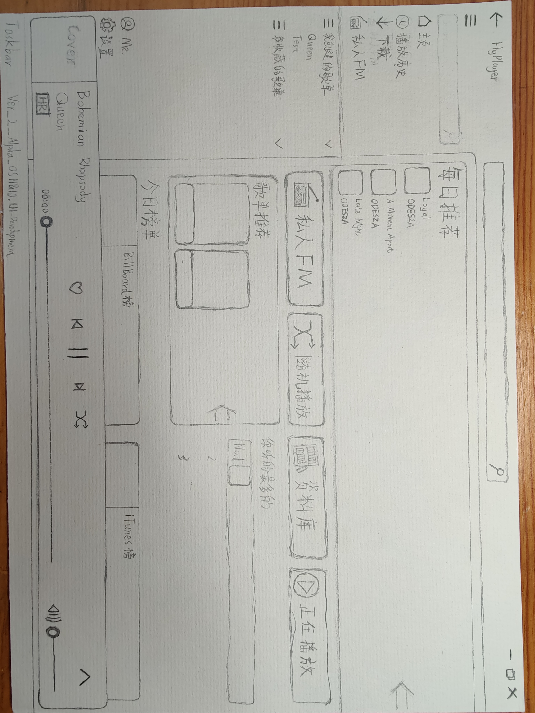

# 界面设计相关

## 背景图相关

**暗色模式未裁剪**

**暗色模式裁剪**

> 图片自 @aaaaaaccd 的摄影
>
> 采用 CC BY-NC-SA 4.0 共享
>
> @kengwang: 很美的天空

## 210714 - 新的主页设计

Design by aaaaaaccd

Copyright © aaaaaaccd 2021

## 2021 - 07 - 21 展开播放器重新设计

这个最初是在 Figma 上设计的, 本人第一次用 Figma , 也在慢慢摸索中.

https://www.figma.com/file/qeXLvA9vpAd26RIrRqBwrX/HyPlayer-2.2.0-Design-Drafts?node-id=5%3A127

同时也感谢群友几天以来的持续关注和建议

最终效果 (2021 / 8 / 1):

(暗色模式)

(亮色模式)

Design by kengwang

Copyright © kengwang 2021

