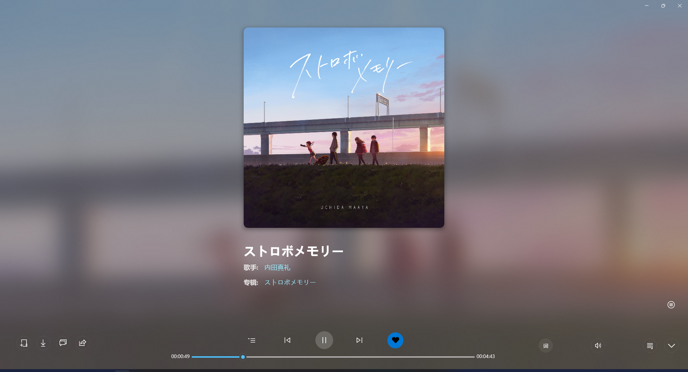
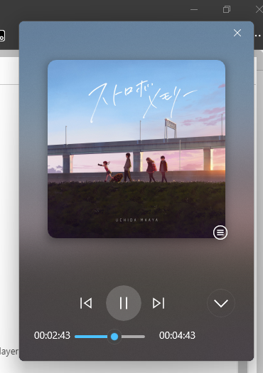
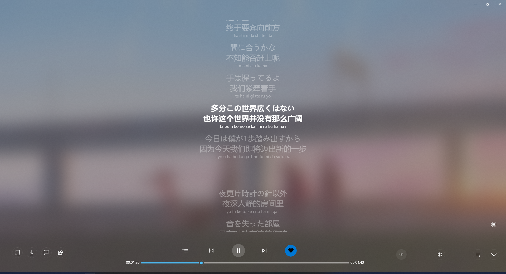
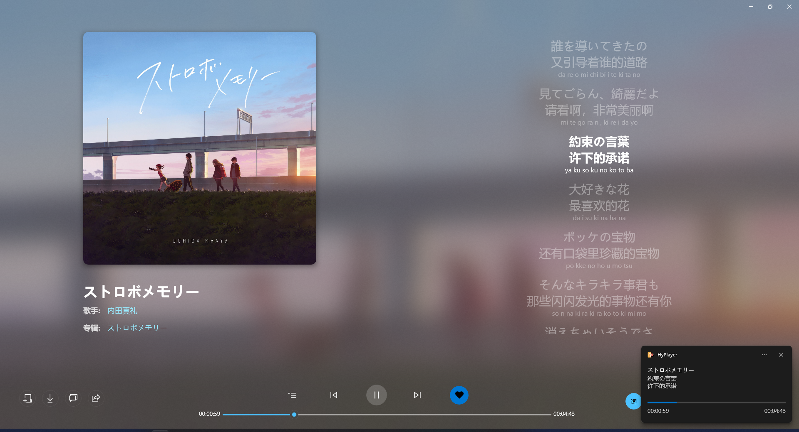

# HyPlayer 效果预览 - 暗色

**播放页面**

**歌单页面**

**主页**

**登录**

**听歌排行**

**我的收藏**

**评论**

**用户页**

**Toast歌词**

> 截图时版本号 2.0.19.0
>
> 请注意: 由于目前还在开发中,请以实际交付为准
>
> Designed by [aaaaaaccd](https://github.com/aaaaaaccd) & [kengwang](https://github.com/kengwang) 
>
> Copyright © HyPlayer Develop Team
>
> All rights reserved.

