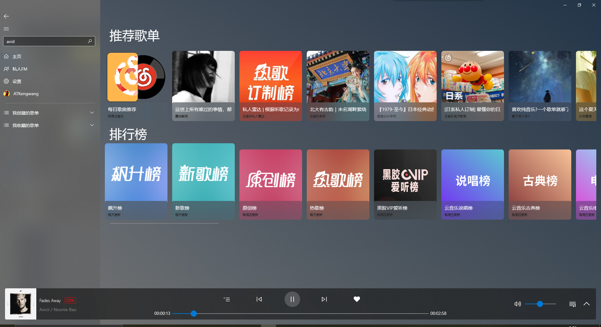
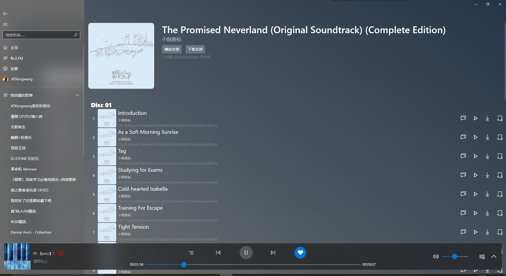

# 效果预览

> 请注意: 由于目前还在开发中,请以实际交付为准
>
> Designed by [aaaaaaccd](https://github.com/aaaaaaccd) & [kengwang](https://github.com/kengwang) 
>
> Copyright © HyPlayer Develop Team
>
> All rights reserved

> 作者的 Windows 使用的是暗色主题,故提供暗色主题预览图

**播放页面**

**Super-mini 模式**

> 此模式将会启用窗口置顶,你可以将其当作迷你播放控件 双击展开后的播放器的歌曲标题即可显示 再次双击标题即可恢复正常模式

**主页**

**搜索**

**用户歌单**

> 此页面可能会有较大改动,请以实际交付为准

**歌单详情**

**歌手页面**

**评论区**

**专辑**

> 其他界面待制作 / 完善 / 优化

